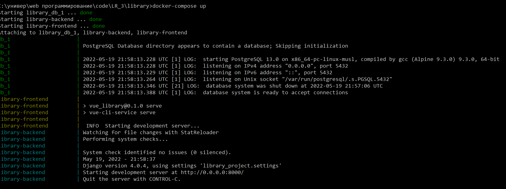
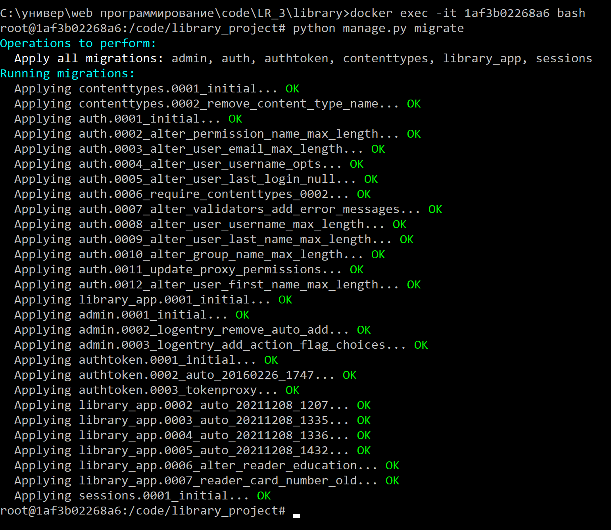

# Docker + Docker compose

## Database

`settings.py`

```
DATABASES = {
    'default': {
        'ENGINE': 'django.db.backends.postgresql_psycopg2',
        'NAME': 'library_db',
        'USER': 'postgres',
        'PASSWORD': 'postgrespwd',
        'HOST': 'db',
        'PORT': '5432',
    }
}
```

## Backend
`Dockerfile`

```
FROM python:3

ENV PYTHONUNBUFFERED 1
RUN mkdir /code
WORKDIR /code/library_project
COPY . /code/
RUN pip install -r requirements.txt
```

`requirements.txt`
```
Django==4.0.4
djangorestframework==3.13.1
psycopg2==2.9.3
djoser==2.1.0
pandas==1.4.0
drf_yasg==1.20.0
django-cors-headers==3.11.0
```

## Frontend
`Dockerfile`

```
FROM node:lts-alpine

WORKDIR /code/vue_library
COPY package*.json ./
COPY . /code

EXPOSE 8080

RUN npm install -g npm
RUN npm install -g @vue/cli

RUN npm install
```

## Docker-compose
`docker-compose.yml`

```
version: '3'

services:
  db:
    image: postgres:13.0-alpine
    volumes:
      - ./data/db:/var/lib/postgresql/data/
    environment:
      - POSTGRES_DB=library_db
      - POSTGRES_USER=postgres
      - POSTGRES_PASSWORD=postgres
    ports:
      - "5432:5432"


  django_rest_framework:
    build:
      context: .
      dockerfile: library_project/Dockerfile
    container_name: library-backend
    command: bash -c 'sleep 10 && python manage.py runserver 0.0.0.0:8000'
    volumes:
      - .:/code
    ports:
      - "8000:8000"
    depends_on:
      - db

  vue:
    build:
      context: .
      dockerfile: vue_library/Dockerfile
    container_name: library-frontend
    command: npm run serve
    volumes:
      - .:/code
    ports:
      - "8080:8080"
    depends_on:
      - django_rest_framework
```

## Commands
1. `docker-compose build`
2. `docker-compose up`



3. `docker exec -it 1af3b02268a6 bash`
4. `python manage.py migrate` - перенос таблиц в контейнер `postgres`


