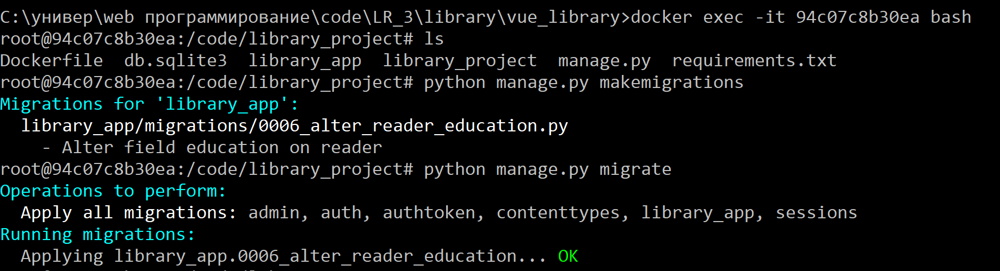

# Миграции внутри контейнера

## Внесение изменений в модель
Изменена база данных: в модели `Reader` возможные значения поля `Education` с *неоконченное высшее* и *неоконченное среднее* изменены на *неполное высшее* и *неполное среднее*.

## Выполнение миграций в контейнере
1. `docker ps -a`
2. `docker start 94c07c8b30ea`
3. `docker exec -it 94c07c8b30ea bash`
4. `python manage.py makemigrations`
5. `python manage.py migrate`
   

6. `exit`
7. `docker stop 94c07c8b30ea`