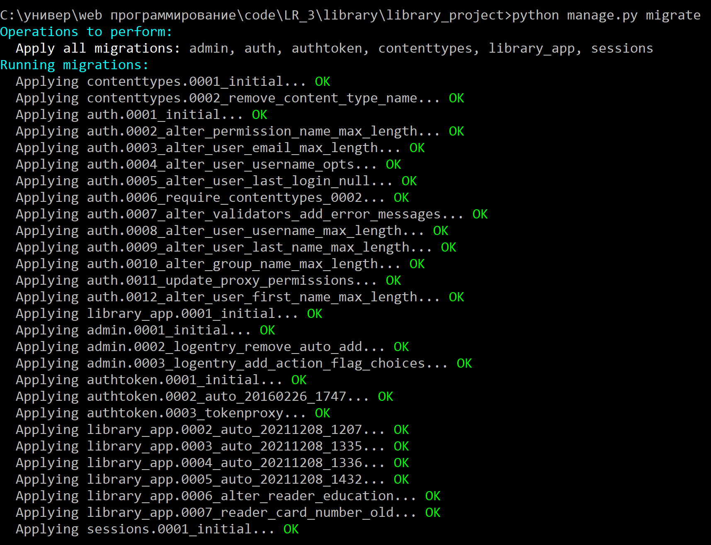
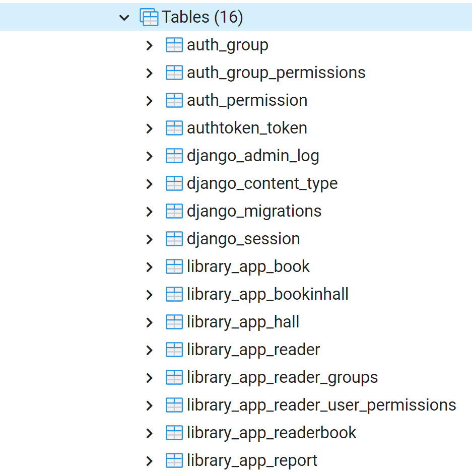
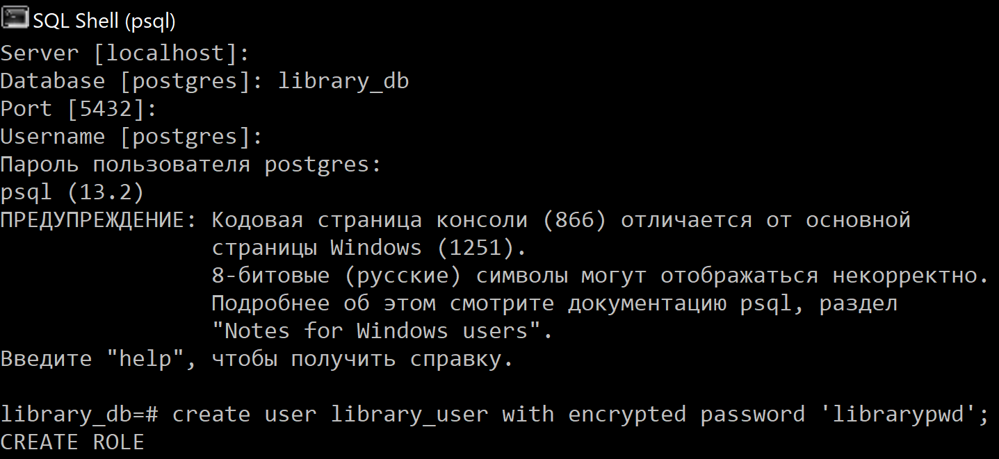
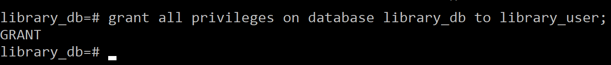

# Создание пользователя postgres

Чтобы перенести таблицы в `postgres`, выполняем команду `python manage.py migrate`.

Для создания нового пользователя в командной строке `postgres` выполняются следующие команды:  
1. `create user library_user with encrypted password 'librarypwd';`  
2. `grant all privileges on database library_db to library_user;`

