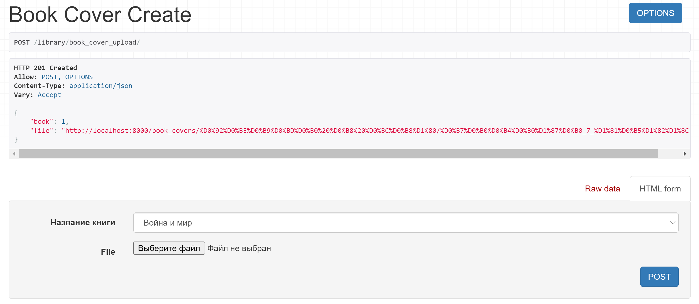

# Загрузка и валидация файлов

## Модель

```
def get_upload_path(instance, filename):
    return os.path.join('book_covers', str(instance.book), filename)

class BookCover(models.Model):
    book = models.ForeignKey('Book', on_delete=models.CASCADE, 
        verbose_name='Название книги')
    filename = models.CharField(max_length=50, verbose_name='Имя файла', 
        blank=True, null=True)
    file_size = models.IntegerField(verbose_name="Размер файла", 
        blank=True, null=True)
    file = models.FileField(validators=[validate_file_size, validate_file_type],
                            upload_to=get_upload_path
                            )
    filename = file.name

    def __str__(self):
        return 'Обложка ' + str(self.book)

    def save(self, *args, **kwargs):
        self.file_size = self.file.size
        print('self.book =', self.book)
        super(BookCover, self).save(*args, **kwargs)
```

`settings.py` : `MEDIA_ROOT = 'media/'`

## Валидация

Валидация размера файла

```
def validate_file_size(file_upload):
    limit = 200 * 1024 * 1024  # 200 MiB
    # limit = 2 * 1024  # 2 KB

    if file_upload.size > limit:
        raise ValidationError('The file is too large. '
                              'File size limit is %d.' % limit)
```

Валидация типа файла

```
def validate_file_type(file_upload):
    possible_extensions = ('image/png', 'image/jpeg',
                           'text/plain',  # .txt
                           'text/x-python',  # .py
                           )

    content_type = magic.from_buffer(file_upload.read(), mime=True)
    if content_type not in possible_extensions:
        raise ValidationError('Files of type %s are not supported.' 
                              % content_type)
```

## Загрузка одного файла

**URL** : `book_cover_upload/`

`views.py`

```
class BookCoverCreateView(CreateAPIView):
    queryset = BookCover.objects.all()
    serializer_class = BookCoverSerializer
```

`serializers.py`

```
class BookCoverSerializer(serializers.ModelSerializer):
    class Meta:
        model = BookCover
        fields = ['book', 'file']
```



## Загрузка нескольких файлов

**URL** : `book_cover_multiple/`

`views.py`

```
class BookCoverMultipleView(CreateAPIView):
    queryset = BookCover.objects.all()
    serializer_class = BookCoverSerializer

    def post(self, request, *args, **kwargs):
        files = request.FILES.getlist('file')

        for f in files:
            book_id = request.POST.get('book')
            file_instance = BookCover(book=Book.objects.get(id=book_id),
                                      file=f)
            file_instance.save()

        return Response(request.data, status=status.HTTP_201_CREATED)

```