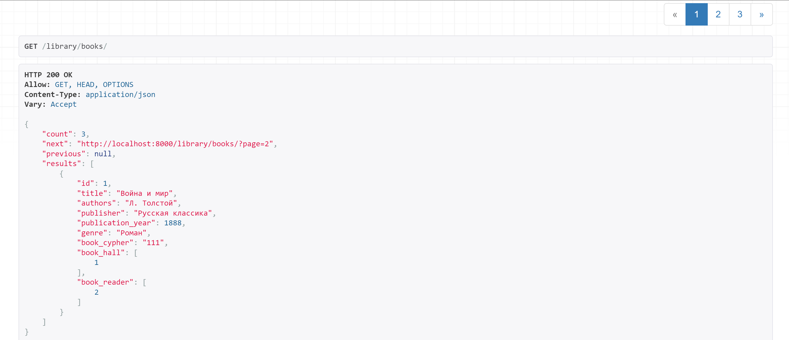
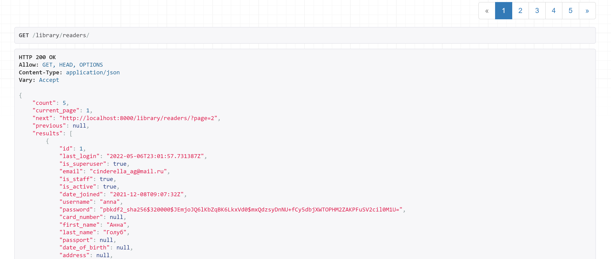

# Пагинация

## Стандартная пагинация
`settings.py`
```
REST_FRAMEWORK = {
    ...
    'DEFAULT_PAGINATION_CLASS': 
        'rest_framework.pagination.PageNumberPagination',
    'PAGE_SIZE': 1,
}
```
**URL**: `library/books/`



## Кастомная пагинация
`pagination.py`
```
class CustomPagination(pagination.PageNumberPagination):
    def get_paginated_response(self, data):
        return Response(OrderedDict([
            ('count', self.page.paginator.count),
            ('current_page', self.page.number),
            ('next', self.get_next_link()),
            ('previous', self.get_previous_link()),
            ('results', data)
        ]))
```

`views.py`
```
class ReaderListAPIView(ListAPIView):
    serializer_class = ReaderSerializer
    queryset = Reader.objects.all()
    pagination_class = CustomPagination
```

**URL**: `library/readers/`

