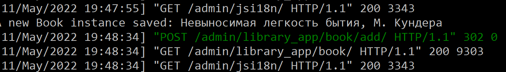
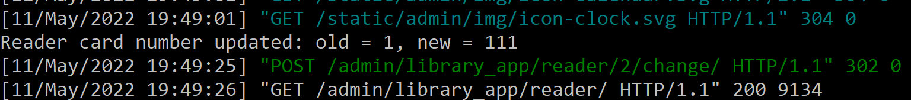
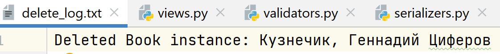

# Сигналы

## Вызывает логику во время создания экземпляра объекта
Выводит сообщение на экран при добавлении новой книги в каталог.

`signals.py`
```
@receiver(pre_save, sender=Book)
def on_create_book(sender, instance, **kwargs):
    if instance.id is None:
        print('A new Book instance created: %s, %s' % (instance.title, instance.authors))
```

`apps.py`
```
class LibraryAppConfig(AppConfig):
    default_auto_field = 'django.db.models.BigAutoField'
    name = 'library_app'

    def ready(self):
        from . import signals
```



## Сохраняет значения выбранных полей в таблице в специальные поля для хранения предыдущих значений при обновлении объекта
При изменении номера читательского билета сохраняет старый номер билета в специальное поле.

`signals.py`
```
@receiver(pre_save, sender=Reader)
def on_change_reader_card_number(sender, instance, **kwargs):
    if instance.id is not None:
        previous = Reader.objects.get(id=instance.id)
        if previous.card_number != instance.card_number:
            instance.card_number_old = previous.card_number
            print('Reader card number updated: old = %s, new = %s' %
                  (instance.card_number_old, instance.card_number))
```



## При удалении объекта записывает информацию об удалении в лог, реализованный любым образом
При удалении книги из библиотеки записывает сообщение в файл `delete_log.txt`.

```
@receiver(pre_delete, sender=Book)
def on_delete_book(sender, instance, **kwargs):
    with open('delete_log.txt', 'a') as log_file:
        log_file.write('Deleted Book instance: %s, %s' % (instance.title, instance.authors))
```


