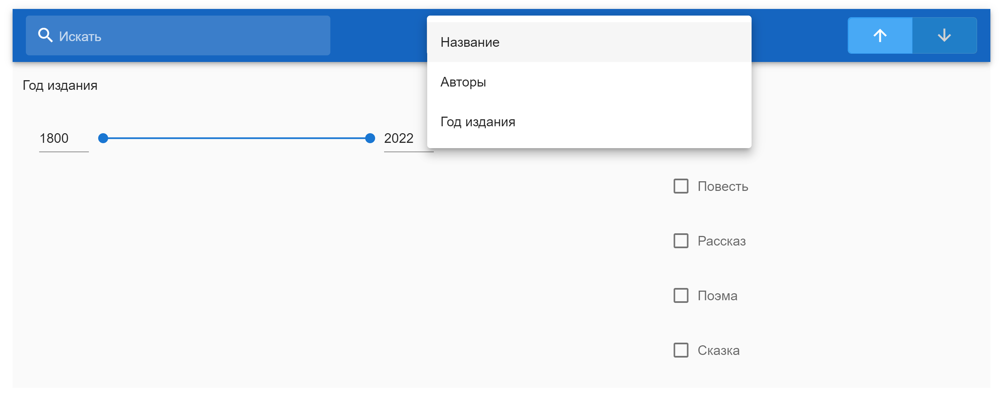
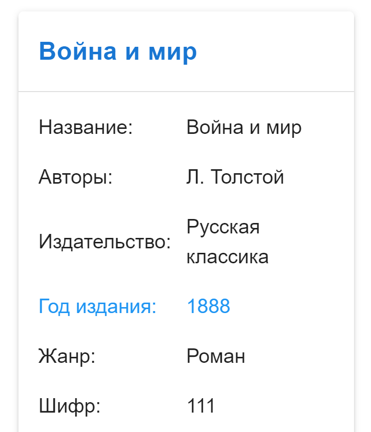
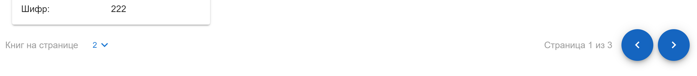
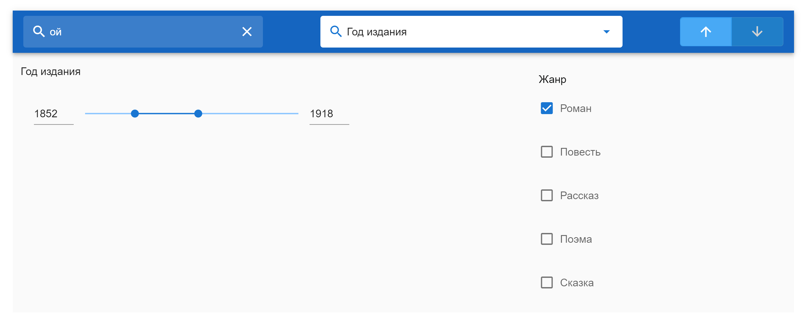

# Фильтрация и сортировка во Vue.js

На страницу каталога библиотеки добавлена возможность поиска и сортировки.

**URL** : `library/books/`

## Сортировка объектов

Возможна сортировка по возрастанию или убыванию по:
* названию
* автору
* году издания

Также можно задать направление сортировки.

Поле, по которому отсортировано, выделяется синим.
Нажав на название книги, можно перейти на страницу с информацией о ней.

## Пагинация

Можно задать число объектов на странице. 
Отображается общее число страниц и номер текущей.

## Поиск по объектам

Поиск ведется в названии и именах авторов. 

## Фильтрация с чекбоксами

Можно выбрать жанры, которые будут представлены в каталоге.

## Фильтры на диапазон

Можно задать диапазон года издания книги.

